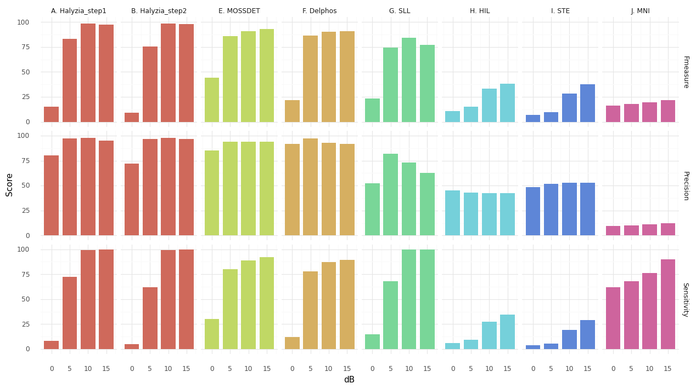

# Description
This notebook presents the performance of Halyzia in the detection of Fast Ripples at different signal to noise ratios: 0dB, 5 dB, 10 dB and 15 dB. The data used to do this work are the gold standard of the literature [1], used by several authors to evaluate their Fast Ripples, Ripples or intercritical spikes detector. Indeed, the data are composed of these 3 types of events that can appear alone or in combination.

| Event type      | 0 dB | 5dB     | 10dB     | 15dB     | **TOTAL**     |
| :---        |    :----:   |    :----:     |    :----:     |    :----:     |    :----:     |
| FR alone      | n=1140 | n=1140     | n=1140     | n=1140     | **n=5,760**     |
| FR + Ripple      | n=1140 | n=1140     | n=1140     | n=1140     | **n=5,760**     |
| FR + Spike      | n=1140 | n=1140     | n=1140     | n=1140     | **n=5,760**     |
| FR + Spike + Ripple      | n=1140 | n=1140     | n=1140     | n=1140     | **n=5,760**     |
| Spike + Ripple      | n=1140 | n=1140     | n=1140     | n=1140     | **n=5,760**     |
| Spike alone      | n=1140 | n=1140     | n=1140     | n=1140     | **n=5,760**     |
| Ripple alone      | n=1140 | n=1140     | n=1140     | n=1140     | **n=5,760**     |
| **TOTAL**      | **n=10,080** | **n=10,080**     | **n=10,080**     | **n=10,080**     | **n=40,320**

**Méthodes:**
- Events that contain an FR and are detected by the algorithm are considered true positives (TP). 
- Events that do not contain an FR and are detected by the algorithm are considered false positives (FP). 
- Events that contain an FR and are not detected by the algorithm are considered false negatives (FN). 
- Events that do not contain FR and are not detected by the algorithm are considered true negatives (TN). 

Sensitivity (sens) was calculated as follow:
$$ TP \over TP + FA $$

Precision (prec) was calculated as follow:
$$ TP \over TP + FN $$

F measure was calculated as follow:
$$ 2 * (prec * sens) \over (prec + sens) $$

We compared the performance of Halyzia with other detectors evaluated on the same data (see also [1]).

# Summary figure

**References:**
[1] Roehri, N., Pizzo, F., Bartolomei, F., Wendling, F., & Bénar, C. G. (2017a). What are the assets and weaknesses of HFO detectors? A benchmark framework based on realistic simulations. PLoS ONE, 12(4). https://doi.org/10.1371/journal.pone.0174702

